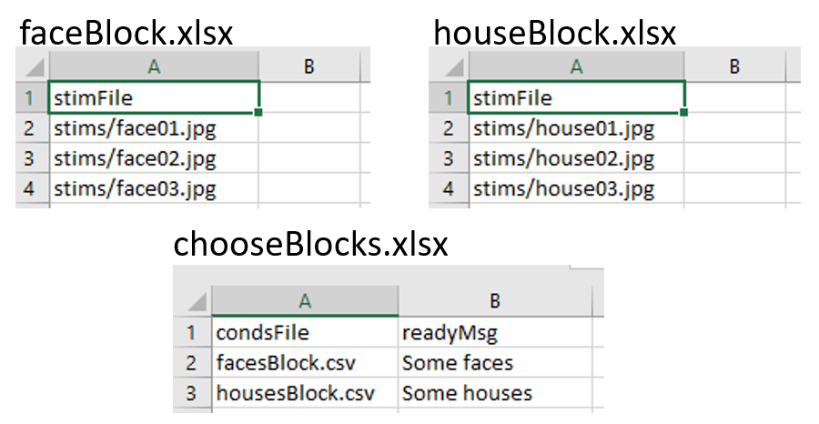
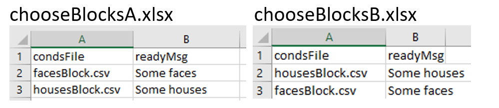
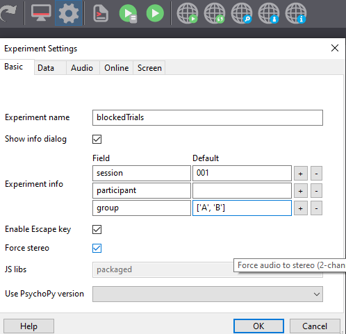
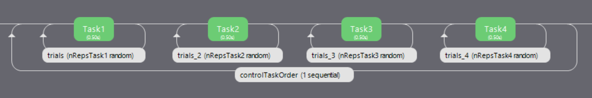
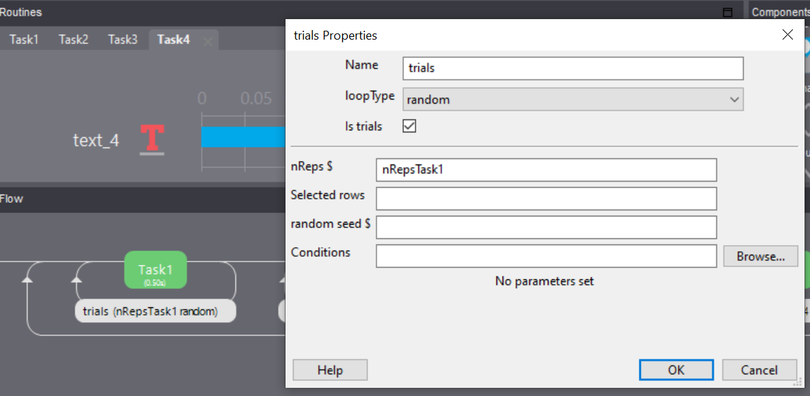
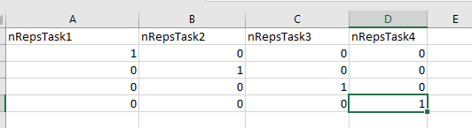
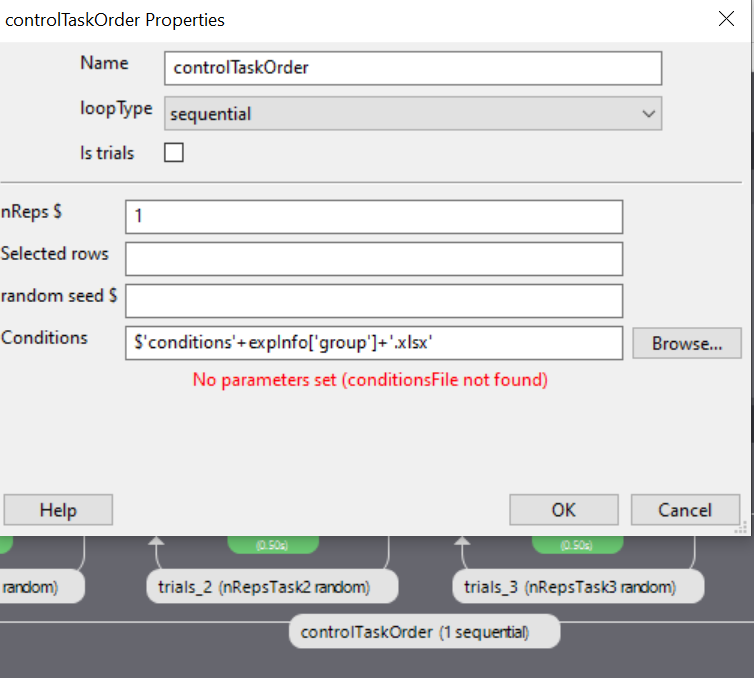

.. _blocksCounter:

Blocks of trials and counterbalancing
--------------------------------------

Many people ask how to create blocks of trials, how to randomise them, and how to counterbalance their order. This isn't all that hard, although it does require a bit of thinking!

Blocking similar conditions
~~~~~~~~~~~~~~~~~~~~~~~~~~~~

The key thing to understand is that you should not create different Routines for different trials in your blocks (if at all possible). Try to define your trials with a single Routine. For instance, let's imagine you're trying to create an experiment that presents a block of pictures of houses or a block of faces. It would be tempting to create a Routine called `presentFace` and another called `presentHouse` but you actually want just one called `presentStim` (or just `trial`) and then set that to differ as needed across different stimuli.

This example is included in the Builder demos, as of |PsychoPy| 1.85, as "images_blocks".

You can add a loop around your trials, as normal, to control the trials within a block (e.g. randomly selecting a number of images) but then you will have a second loop around this to define how the blocks change. You can also have additional Routines like something to inform participants that the next block is about to start.

.. image:: blocksImagesFlow.png

So, how do you get the block to change from one set of images to another? To do this create three spreadsheets, one for each block, determining the filenames within that block, and then another to control which block is being used:



**Setting up the basic conditions.** The facesBlock, and housesBlock, files look more like your usual conditions files. In this example we can just use a variable `stimFile` with values like `stims/face01.jpg` and `stims/face02.jpg` while the housesBlock file has `stims/house01.jpg` and `stims/house02.jpg`. In a real experiment you'd probably also have response keys andsuchlike as well.

**So, how to switch between these files?** That's the trick and that's what the other file is used for. In the `chooseBlocks.xlsx` file you set up a variable called something like `condsFile` and that has values of `facesBlock.xlsx` and `housesBlock.xlsx`. In the outer (blocks) loop you set up the conditions file to be `chooseBlocks.xlsx` which creates a variable `condsFile`. Then, in the inner (trials) loop you set the conditions file not to be any file directly but simply `$condsFile`. Now, when |PsychoPy| starts this loop it will find the current value of `condsFile` and insert the appropriate thing, which will be the name of an conditions file and we're away!

Your `chooseBlocks.xlsx` can contain other values as well, such as useful identifiers. In this demo you could add a value `readyText` that says "Ready for some houses", and "Ready for some faces" and use this in your get ready Routine.

Variables that are defined in the loops are available anywhere within those. In this case, of course, the values in the outer loop are changing less often than the values in the inner loop.

Counterbalancing similar conditions
~~~~~~~~~~~~~~~~~~~~~~~~~~~~~~~~~~~

Counterbalancing is simply an extension of blocking. Until now, we have a *randomised block design*, where the order of blocks is set to random. At the moment we also only have one repeat of each block, but we could also present more than one repeat of each block by controlling the number of rows assigned to each block in our 'chooseBlocks' file.

In a counterbalanced design you want to control the order explicitly and you want to provide a different order for different groups of participants. Maybe group A always gets faces first, then houses, and group B always gets houses first, then faces.

Now we need to create further conditions files, to specify the exact orders we want, so we'd have something like `chooseBlockA.xlsx` and `chooseBlockB.xlsx`:




The last part of the puzzle is how to assign participants to groups. For this you *could* write a Code Component that would generate a variable for you (`if.....: groupFile = "groupB.xlsx"`) but the easiest thing is probably that you, the experimenter, chooses this using the GUI we present at the start of the experiment. So, we add a field to our GUI using experiment settings:



Note that entering a *list* as the default input will present us with a dropdown in our GUI.

Finally, we set parameters of our `blocks` loop to use the method 'sequential' (because we are using a predefined order) and we enter the following into the conditions field:
```
$"chooseBlocks"+expInfo['group']+".xlsx"
```
This will concatenate the string "chooseBlocks" with our selected group ("A" or "B") and the required file extension (in this case "xlsx") in order to select the correct order.

Even though our outer loop is now sequential, your inner loop still probably wants to be random (to shuffle the image order within a block).

Counterbalancing different subtasks
~~~~~~~~~~~~~~~~~~~~~~~~~~~~~~~~~~~

The above example is useful when we have multiple blocks where the routines we present would be largely similar (i.e. both blocks present an image component), but what about situations where we have totally different tasks we need to counterbalance (e.g. an auditory stroop and an n-back task). The following method is an extension of the logic used in the 'branchedExp' demo available in |PsychoPy| builderview.
You can download a `working version of the example <https://gitlab.pavlovia.org/lpxrh6/counterbalance_multiple_tasks_demo>`_ we will work through.

So, imagine we have 4 very different tasks. Our flow might look something like this:



Here we have 4 totally different tasks, each with its own loop. Now imagine one participant is presented with these tasks using the order Task1 -> Task2 -> Task3 -> Task 4 (for ease let's call this group, 'ABCD') whilst another is presented with Task2 -> Task3 -> Task4 -> Task 1 (let's call them group 'BCDA').

The loop surrounding each task will look something like this (although here I have stripped the parameters to the bare minimum, you will likely have a conditions file):



Where the number of times that block is repeated (or occurs at all!) is determined by the outer loop (e.g. Task1 nReps = 'nRepsTask1', Task2 nReps = 'nRepsTask2' and so on).

For our outer loop we will use conditions files that look something like this:



Each row corresponds to how many times a subtask routine (or set of routines) will be repeated per iteration of the outer loop. The example conditions file above would be used for a participant in group 'ABCD' (on the first iteration Task 1 will repeat once, on the second iteration Task 2 will repeat once and so on).

Just like before we create a field in our experiment settings called group (but let's say that the group names this time are 'ABCD', 'BCDA' and so on where the content of the conditions file differs).
Finally, we use the following parameters for our outermost loop to select which, preordered, conditions file we are using.



Using this method, we could present several subtasks in a counterbalanced order (without having to create new experiment files for each order!).


What about going **online** ? Well, things are more difficult there, but not impossible let's talk about :ref:`counterbalancingOnline`
