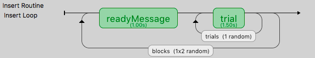

.. _blocksCounter:

Blocks of trials and counterbalancing
--------------------------------------

Many people ask how to create blocks of trials, how to randomise them, and how to counterbalance their order. This isn't all that hard, although it does require a bit of thinking!

Blocking
~~~~~~~~~~~~~

The key thing to understand is that you should not create different Routines for different trials in your blocks (if at all possible). Try to define your trials with a single Routine. For instance, let's imagine you're trying to create an experiment that presents a block of pictures of houses or a block of faces. It would be tempting to create a Routine called `presentFace` and another called `presentHouse` but you actually want just one called `presentStim` (or just `trial`) and then set that to differ as needed across different stimuli.

This example is included in the Builder demos, as of PsychoPy 1.85.

You can add a loop around your trials, as normal, to control the trials within a block (e.g. randomly selecting a number of images) but then you will have a second loop around this to define how the blocks change. You can also have additional Routines like something to inform participants that the next block is about to start.



So, how do you get the block to change from one set of images to another? To do this create three spreadsheets, one for each block, determining the filenames within that block, and then another to control which block is being used:

  - facesBlock.xlsx
  - housesBlock.xlsx
  - chooseBlocks.xlsx

**Setting up the basic conditions.** The facesBlock, and housesBlock, files look more like your usual conditions files. In this example we can just use a variable `stimFile` with values like `stims/face01.jpg` and `stims/face02.jpg` while the housesBlock file has `stims/house01.jpg` and `stims/house02.jpg`. In a real experiment you'd probably also have response keys andsuchlike as well.

**So, how to switch between these files?** That's the trick and that's what the other file is used for. In the `chooseBlocks.xlsx` file you set up a variable called something like `condsFile` and that has values of `facesBlock.xlsx` and `housesBlock.xlsx`. In the outer (blocks) loop you set up the conditions file to be `chooseBlocks.xlsx` which creates a variable `condsFile`. Then, in the inner (trials) loop you set the conditions file not to be any file directly but simply `$condsFile`. Now, when PsychoPy starts this loop it will find the current value of `condsFile` and insert the appropriate thing, which will be the name of an conditions file and we're away!

Your `chooseBlocks.xlsx` can contain other values as well, such as useful identifiers. In this demo you could add a value `readyText` that says "Ready for some houses", and "Ready for some faces" and use this in your get ready Routine.

Variables that are defined in the loops are available anywhere within those. In this case, of course, the values in the outer loop are changing less often than the values in the inner loop.

Counterbalancing
~~~~~~~~~~~~~~~~~~~~

Counterbalancing is simply an extension of blocking. Usually with a block design you would set the order of blocks to be set randomly. In the example above the blocks are set to occur randomly, but note that they could also be set to occur more than once if you want 2 repeats of the 2 blocks for a total of 4.

In a counterbalanced design you want to control the order explicitly and you want to provide a different order for different groups of participants. Maybe group A always gets faces first, then houses, and group B always gets houses first, then faces.

Now we need to create further conditions files, to specify the exact orders we want, so we'd have something like `groupA.xlsx`:

  +------------------+
  |  condsFile       |
  +==================+
  | housesBlock.xlsx |
  +------------------+
  | facesBlock.xlsx  |
  +------------------+

and `groupB.xlsx`:

  +------------------+
  |  condsFile       |
  +==================+
  | facesBlock.xlsx  |
  +------------------+
  | housesBlock.xlsx |
  +------------------+

In this case the last part of the puzzle is how to assign participants to groups. For this you *could* write a Code Component that would generate a variable for you (`if.....: groupFile = "groupB.xlsx"`) but the easiest thing is probably that you, the experimenter, chooses this outside of PsychoPy and simply tells PsychoPy which group to assign to each participant.

The easiest way to do that is to add the field `group` to the initial dialog box, maybe with the default value of `A`. If you set the conditions file for the `blocks` loop to be
```
$"group"+expInfo['group']+".xlsx"
```
then this variable will be used from the dialog box to create the filename for the blocks file and you.

Also, if you're doing this, remember to set the `blocks` loop to use "sequential" rather than "random" sorting. Your inner loop still probably wants to be random (to shuffle the image order within a block) but your outer loop should now be using exactly the order that you specified in the blocks condition file.
