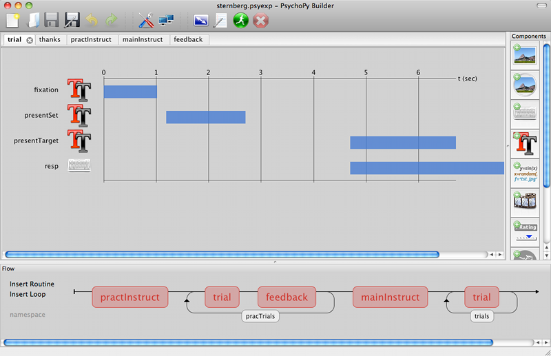

.. _builder:

Builder
================================================

*Building experiments in a GUI*

You can now see a `youtube PsychoPy tutorial <http://www.youtube.com/watch?v=VV6qhuQgsiI>`_ showing you how to build a simple experiment in the Builder interface

.. note::

    The Builder view is now (at version 1.75) fairly well-developed and should be able to construct a wide variety of studies. But you should still check carefully that the stimuli and response collection are as expected.
    

   

Contents:

.. toctree::
   :maxdepth: 2
   :glob:

   concepts
   routines
   flow
   components
   settings
   startStop
   outputs
   gotchas
   compileScript
   *

Future developments
-----------------------

The builder view still has a few rough edges, but is hopefully fairly usable. Here are some of the ways I hope it will improve:

* More components. Several of the stimuli and events that PsychoPy can handle don't currently show up as components in the builder view, but they can be added easily (take a look inside the components directory to see how easy it is to create a component).
* Dialogue entry validation. Dialogue boxes currently allow you to type almost anything into their windows. The only current checking is that a name is given to the component and that this is unique. More checking is needed to reduce errors.
* Similar to the above, I hope to add suggested entries to go into dialogs, as a form of help. e.g. on right-clicking an entry box, say for stimulus orientation, a context menu should appear with ideas including numeric values, known local variables (e.g. "thisTrial.rgb", based on the existing loops in the :doc:`Flow </builder/flow>`) and global variable ideas (e.g. "frameN*360")
* Better code output. I hope that the builder output code will illustrate best practice for precise timing and stimulus presentation (it will probably always take more lines than a man-made script, but it should be at least as precise). At the moment that isn't the case. e.g. The builder should strongly recommend an interval between trials where only static stimuli are drawn (e.g. fixation) and update components for this trial in that interval.
