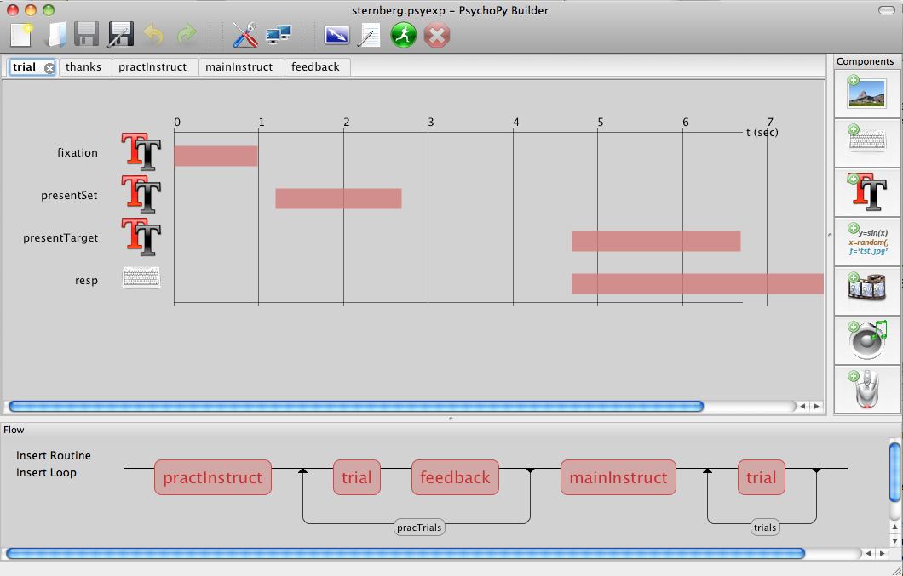

.. _builder:

Builder
================================================

*Building experiments in a GUI*

You can now see a `youtube PsychoPy tutorial <http://www.youtube.com/watch?v=VV6qhuQgsiI>`_ showing you how to build a simple experiment in the Builder interface

.. note::

    The Builder view is now (at version 1.75) fairly well-developed and should be able to construct a wide variety of studies. But you should still check carefully that the stimuli and response collection are as expected.

Contents:

.. toctree::
   :maxdepth: 2
   :glob:

   concepts
   routines
   flow
   blocksCounterbalance
   components
   settings
   startStop
   outputs
   gotchas
   compileScript
   *

Future developments
-----------------------

The new big feature, which we're really excited about is that Builder experiments are going to web-enabled very soon! Make sure you watch for new posts in the `PsychoPy forum Announcements <https://discourse.psychopy.org/c/announce>`_ category so you get updates of when this is available.
