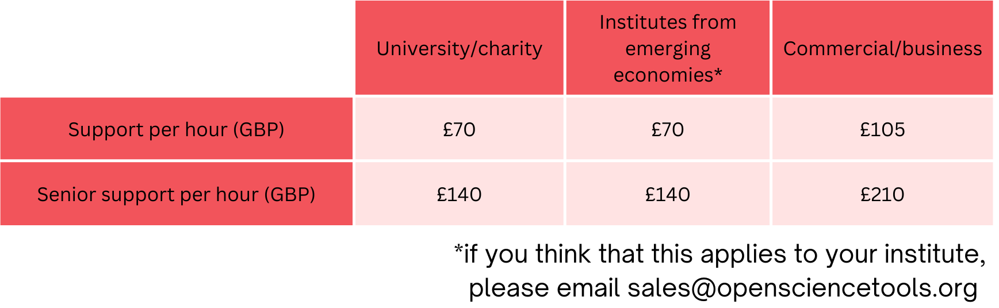

Consultancy services
======================

.. raw:: html

   

       
       
       
       
   

   

How much does it cost?
--------------------------------

These are our costs per hour of support:

How can I get support?
--------------------------------

Just use the button below to get in touch!

.. raw:: html

    <a href="https://forms.clickup.com/4570406/f/4bf96-7552/ZN8URSTDTWDENY6RP9" style="background-color: lightblue; color: white; padding: 10px 20px; text-align: center; text-decoration: none; display: inline-block; border-radius: 5px;">Get in touch!</a>
