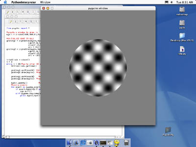

Drifting plaid demo
=====================================

The following code also checks for a keypress. The timing method simply uses a Clock object with the .getTime() call. This is very easy to code, but not quite as accurate as using the frame tick. 

.. literalinclude:: plaid.py
