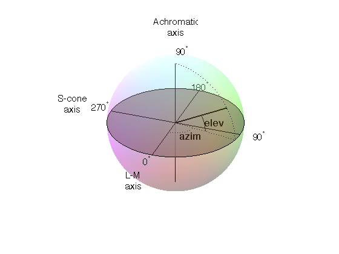

.. _colorspaces:

Color spaces
====================================

The color of stimuli can be specified when creating a stimulus and when using setColor() in a variety of ways. There are three basic color spaces that PsychoPy can use, RGB, DKL and LMS but colors can also be specified by a name (e.g. 'DarkSalmon') or by a hexadecimal string (e.g. '#00FF00').

examples::

    stim = visual.GratingStim(win, color=[1,-1,-1], colorSpace='rgb') #will be red
    stim.setColor('Firebrick')#one of the web/X11 color names
    stim.setColor('#FFFAF0')#an off-white
    stim.setColor([0,90,1], colorSpace='dkl')#modulate along S-cone axis in isoluminant plane
    stim.setColor([1,0,0], colorSpace='lms')#modulate only on the L cone
    stim.setColor([1,1,1], colorSpace='rgb')#all guns to max
    stim.setColor([1,0,0])#this is ambiguous - you need to specify a color space

.. _colorNames:

Colors by name
----------------
Any of the `web/X11 color names <https://www.w3schools.com/Colors/colors_names.asp>`_ can be used to specify a color. These are then converted into RGB space by PsychoPy.

These are not case sensitive, but should not include any spaces.

.. _hexColors:

Colors by hex value
--------------------
This is really just another way of specifying the r,g,b values of a color, where each gun's value is given by two hexadecimal characters. For some examples see `this chart <http://html-color-codes.com/>`_. To use these in PsychoPy they should be formatted as a string, beginning with `#` and with no spaces. (NB on a British Mac keyboard the # key is hidden - you need to press Alt-3)

.. _RGB:

RGB color space
-------------------
This is the simplest color space, in which colors are represented by a triplet of values that specify the red green and blue intensities. These three values each range between -1 and 1.

Examples:

    * [1,1,1] is white
    * [0,0,0] is grey
    * [-1,-1,-1] is black
    * [1.0,-1,-1] is red
    * [1.0,0.6,0.6] is pink

The reason that these colors are expressed ranging between 1 and -1 (rather than 0:1 or 0:255) is that many experiments, particularly in visual science where PsychoPy has its roots, express colors as deviations from a grey screen. Under that scheme a value of -1 is the maximum decrement from grey and +1 is the maximum increment above grey.

Note that PsychoPy will use your monitor calibration to linearize this for each gun. E.g., 0 will be halfway between the minimum luminance and maximum luminance for each gun, if your monitor gammaGrid is set correctly.

.. _HSV:

HSV color space
------------------

Another way to specify colors is in terms of their Hue, Saturation and 'Value' (HSV). For a description of the color space see the `Wikipedia HSV entry <http://en.wikipedia.org/wiki/HSL_and_HSV>`_. The Hue in this case is specified in degrees, the saturation ranging 0:1 and the 'value' also ranging 0:1.

Examples:

    * [0,1,1] is red
    * [0,0.5,1] is pink
    * [90,1,1] is cyan
    * [anything, 0, 1] is white
    * [anything, 0, 0.5] is grey
    * [anything, anything,0] is black

Note that colors specified in this space (like in RGB space) are not going to be the same another monitor; they are device-specific. They simply specify the intensity of the 3 primaries of your monitor, but these differ between monitors. As with the RGB space gamma correction is automatically applied if available.

.. _DKL:

DKL color space
-------------------
To use DKL color space the monitor should be calibrated with an appropriate spectrophotometer, such as a PR650.

In the Derrington, Krauskopf and Lennie [#dkl1984]_ color space (based on the Macleod and Boynton [#mb1979]_ chromaticity diagram) colors are represented in a 3-dimensional space using spherical coordinates that specify the `elevation` from the isoluminant plane, the `azimuth` (the hue) and the contrast (as a fraction of the maximal modulations along the cardinal axes of the space).

In PsychoPy these values are specified in units of degrees for elevation and azimuth and as a float (ranging -1:1) for the contrast.

Note that not all colors that can be specified in DKL color space can be reproduced on a monitor. `Here <http://youtu.be/xwoVrGoBaWg>`_ is a movie plotting in DKL space (showing `cartesian` coordinates, not spherical coordinates) the gamut of colors available on an example CRT monitor.

Examples:

    * [90,0,1] is white (maximum elevation aligns the color with the luminance axis)
    * [0,0,1] is an isoluminant stimulus, with azimuth 0 (S-axis)
    * [0,45,1] is an isoluminant stimulus,with an oblique azimuth

.. [#dkl1984] Derrington, A.M., Krauskopf, J., & Lennie, P. (1984). Chromatic Mechanisms in Lateral Geniculate Nucleus of Macaque. Journal of Physiology, 357, 241-265.

.. [#mb1979] MacLeod, D. I. A. & Boynton, R. M. (1979). Chromaticity diagram showing cone excitation by stimuli of equal luminance. Journal of the Optical Society of America, 69(8), 1183-1186.

.. _LMS:

LMS color space
--------------------
To use LMS color space the monitor should be calibrated with an appropriate spectrophotometer, such as a PR650.

In this color space you can specify the relative strength of stimulation desired for each cone independently, each with a value from -1:1. This is particularly useful for experiments that need to generate cone isolating stimuli (for which modulation is only affecting a single cone type).
