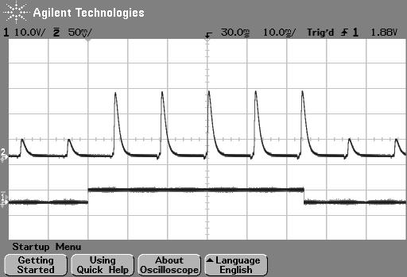
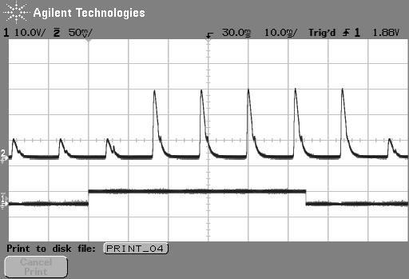

Can PsychoPy deliver millisecond precision?
---------------------------------------------

.. _Labhackers Millikey: http://labhackers.com/millikey.html

The simple answer is 'yes'. PsychoPy's timing is as good as (or in most cases better than) any package out there. 

The longer answer is that you should test the timing of your own experimental stimuli on your own hardware. Very often a computer is not optimally configured to produce good timing, and a poorly code experiment could also destroy your timing. Many software and hardware manufacturers will suggest that the key to this is using computer clocks with high precision (lots of decimal places) but that is not the answer at all. The sources of error in stimulus/response timing are almost never to do with the poor precision of the clock. The following issues are extremely common and **until you actually test your experiment you don't realise that your timing is being affected by them**:

- :ref:`monitorDelays`: e.g. the monitor taking additional time to process the image before presentation
- :ref:`OSdelays`: Windows, Linux and Mac all perform further processing on the images, depending on settings and this can delay your visual stimulus delivery by a further frame interval or more
- :ref:`codingDelays` 
- :ref:`keyboardDelays`
- :ref:`audioDelays`

The clocks that PsychoPy uses do have sub-millisecond precision but your keyboard has a latency of 4-25ms depending on your platform and keyboard. You could buy a response pad (e.g. a `Labhackers Millikey`_) for reponse timing with a sub-ms precision, but note that there will still be an apparent lag that is dependent on the monitor's absolute lag and the position of the stimulus on it.

Also note that the variance in terms of response times between your participants, and from trial to trial within a participant, probably dwarfs that of your keyboard and monitor issues!
That said, PsychoPy does aim to give you as high a temporal precision as possible and, in a well-configured system achieves this very well.

.. _monitorTiming:

Computer monitors 
---------------------------------------------

There are several issues with monitors that you should be aware of. 

#. :ref:`monitorFixedRefresh`
#. :ref:`monitorRendersTopFirst`
#. :ref:`monitorDelays`

.. _monitorFixedRefresh:

Monitors have fixed refresh rates
~~~~~~~~~~~~~~~~~~~~~~~~~~~~~~~~~~~~~

Most monitors have fixed refresh rates, typically 60 Hz for a flat-panel display. You probably knew that but it's very easy to forget that this means certain stimulus durations won't be possible. If your screen is a standard 60 Hz monitor then your frame period is 1/60 s, roughly 16.7 ms. That means you can generate stimuli that last for 16.7 ms, or 33.3 ms or 50 ms, but you **cannot** present a stimulus for 20, 40, or 60 ms.

The caveat to this is that you can now buy specialist monitors that support variable refresh rates (although not below at least 5 ms between refreshes). These are using a technology called G-Sync (nVidia) or FreeSync (everyone else) and PsychoPy can make use of those technologies but support isn't built in to the library. See the publication by `Poth et al (2018)<https://link.springer.com/article/10.3758/s13428-017-1003-6>`_ for example code.

.. _monitorRendersTopFirst:

The top of the screen appears 5-15 ms before the bottom
~~~~~~~~~~~~~~~~~~~~~~~~~~~~~~~~~~~~~~~~~~~~~~~~~~~~~~~~~

For most monitor technologies, the lines of pixels are drawn sequentially from the top to the bottom and once the bottom line has been drawn the screen is finished and the line returns to the top (the Vertical Blank Interval, VBI). Most of your frame interval is spent drawing the lines, with 1-2ms being left for the VBI. This means that the pixels at the bottom are drawn '''up to 10 ms later''' than the pixels at the top of the screen. At what point are you going to say your stimulus 'appeared' to the participant?

    Figure 1: photodiode trace at top of screen. The image above shows the luminance trace of a CRT recorded by a fast photo-sensitive diode at the top of the screen when a stimulus is requested (shown by the square wave). The square wave at the bottom is from a parallel port that indicates when the stimulus was flipped to the screen. Note that on a CRT the screen at any point is actually black for the majority of the time and just briefly bright. The visual system integrates over a large enough time window not to notice this. On the next frame after the stimulus 'presentation time' the luminance of the screen flash increased.

    Figure 2: photodiode trace of the same large stimulus at bottom of screen. The image above shows comes from exactly the same script as the above but the photodiode is positioned at the bottom of the screen. In this case, after the stimulus is 'requested' the current frame (which is dark) finishes drawing and then, 10ms later than the above image, the screen goes bright at the bottom.

.. _monitorDelays:

Additional delays caused by monitors
~~~~~~~~~~~~~~~~~~~~~~~~~~~~~~~~~~~~~~~~

Monitors themselves often cause delays **on top of** the unavoidable issue of having a refresh rate. Modern displays often have features to optimize the image, which will be often labelled as modes like "Movie Mode", Game Mode" etc. If your display has any such settings then you want to turn them off so as not to change your image. Not only do these settings ential altering the color of the pixels that your experiment generator is send to the screen (if you've spent time carefully calibrating your colors and then the monitor changes them it would be annoying) but these forms of "post-processing" take time and often a *variable* time. 

If your monitor has any such "post-processing" enabled then you might well be seeing an additional 20-30 ms of (variable) lag added to the stimulus onset as a result. This **will not** be detected by psychoPy (or any other system) and will not show up in your log files.

.. _OSdelays:

Delays caused by drivers and OS
---------------------------------------------

All three major operating systems are capable of introducing timing errors into your visual presentations, although these are usually observed as (relatively) constant lags. The particularly annoying factor here is that your experiment might work with very good timing for a while and then the operating system performs and automatic update and the timing gets worse! Again, the only way you would typically know about these sorts of changes is by testing with hardware.

**Triple buffering:** In general PsychoPy, and similar graphics systems, are expecting a double-buffered rendering pipeline, whereby we are drawing to one copy of the screen (the "back buffer") and when we have finished drawing our stimuli we "flip" the screen, at which point it will wait for the next screen refresh period and become visible as the "front buffer". Triple-buffering is a system whereby the images being rendered to the screen are put in a 3rd buffer, and the operating system can do further processing as the rendered image moves from this 3rd buffer to the back buffer. Such a system means that your images all appear exactly one frame later than expected.

Errors caused by triple buffering, either by the operating system or by the monitor, cannot be detected by PsychoPy and will not show up in your log files.

MacOS
~~~~~~~~~~~

The stimulus presentation on MacOS used to be very good, up until version 10.12. In MacOS 10.13 something changed and it appears that a form of triple buffering has been added and, to date, none of the major experiment generators have managed to turn this off. As a result, since MacOS 10.13 stimuli appear always to be presented a screen refresh period later than expected, resulting in a delay of 16.66 ms in the apparent response times to visual stimuli.

Windows 10
~~~~~~~~~~~

In Windows, triple buffering is something that might be turned on by default in your graphics card settings (look for 3D, or OpenGL, settings in the driver control panel to turn this off). The reason it gets used is that it often results in a more consistent frame rate for games, but having the frame appear later then expected is typically bad for experiments!

As well as the graphics card performing triple buffering, the operating system itself (via the Desktop Window Manager) does so under certain conditions:
- Anytime a window is used (instead of full-screen mode) Windows 10 now uses triple buffering
- having Scaling set to anything other than 100% also results in triple-buffering (presumably Microsoft renders the screen once and then scales it during the next refresh).

There are surely other settings in Windows and the graphics card that will alter the timing performance and, again, until you test these you aren't likely to know.

Linux
~~~~~~~~~~

In Linux, again, timing performance of the visual stimuli depends on the graphics card driver but we have also seen timing issues arising from the Window Compositor and with interactions between compositor and driver. 

The real complication here is that in Linux there are many different window compositors (Compiz, XFwm, Enlightenment,...), as well as different options for drivers to install (e.g. for nVidia cards there is a proprietary nVidia driver as well as an open-source "Nouveau" driver which is often the default but has worse performance).

Ultimately, you need to **test the timing with hardware** and work through the driver/compositor settings to optimise the timing performance.

.. _codingDelays:

Delays caused by coding errors
---------------------------------------------

It can be really easy, as a user, to introduce timing errors into your experiment with incorrect coding. Even if you really know what you're doing, it's easy to make a silly mistake, and if you don't really know what you're doing then all bets are definitely off!!

Common ways for this to happen are to forget the operations that are potentially time-consuming. The biggest of these is the loading of images from disk. 

For image stimuli where the image is constant the image should be loaded from disk at the beginning of the script (Builder-generate experiments will do so automatically for you). When an image stimulus has to *change on each trial*, it must be loaded from disk at some point. That typically takes several milliseconds (possibly hundreds of milliseconds for a large image) and while that is happening the screen will not be refreshing. You need to take your image-loading time into account and allow it to occur during a static period of the screen. 

In Builder experiments if you set something to update "On every repeat" then it will update as that Routine begins so, if your trial Routine simply begins with 0.5s fixation period, all your stimuli can be loaded/updated in that period and you will have no further problems. Sometimes you want to load/update your stimulus explicitly at a different point in time and then you can insert a "Static Component" into your Builder experiment (a "Static Period" in the Python API) and then set your stimulus to update during that period (it will show up as an update option after you insert the Static Component).

The good news is that a lot of the visual timing issues caused by coding problems **are** visible in the log files, unlike the problems with hardware and operating systems introducing lags.

.. _keyboardDelays:

Delays caused by keyboards
---------------------------------------------

Keyboards are hopeless for timing. We should expand on that. But for now, it's all you need to know! Get yourself a button box, like the `LabHackers Millikey`_.

.. _audioDelays:

Audio delays
---------------------------------------------

PsychoPy has a number of settings for audio and the main issue here is that the user needs to know to turn on the optimal settings.

For years we were looking for a library that provided fast reliable audio and we went through an number of libraries to optimize that (pygame was the first, with 100ms latencies, then pyo and sounddevice which were faster).

Most recently we added support for the Psychophysics Toolbox audio library (PsychPortAudio), which Mario Kleiner has ported Python in 2018. With that library we can achieve really remarkable audio timing (thanks to Mario for his fantastic work). But still there are several things you need to check to make use of this library and use it to its full potential:

- Make sure you're running with a 64bit installation of Python3. The PsychPortAudio code has not, and almost certainly will not, be built to support legacy Python installations
- Set the PsychoPy preferences to use it! As of PsychoPy version 3.2.x the PTB backend was not the default. In future versions this will probably be the default, but as of version 3.2.x you need to set PsychoPy to use it (we didn't want to make it the default until it had been used without issue in a number of labs in "the wild").
- Make sure that the library settings are using a high 

For further information please see the documentation about the :ref:`Sound library <soundAPI>`

.. figure:: ../../images/audioScope_Win10_PTB_mode3.png

    With the new PTB library you can achieve not only sub-millisecond precision, but roughly sub-millisecond lags!! You do need to know how to configure this though and testing it can only be done with hardware.

