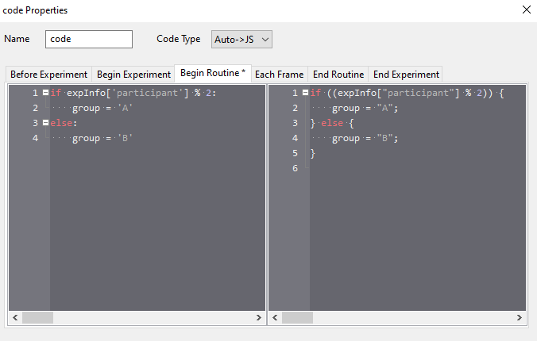

.. _counterbalancingOnline:

Counterbalancing online
-----------------------------------

If you are manually recruiting your participants (i.e. sending our your experiment URL to a unique population or group) the methods described in :ref:`blocksCounter` will also work online, and can be used in the same way. However, if you have your experiment URL advertised on a recruitment website, it could be that 10s or hundreds of participants click your link. Manually assigning participants and keeping track of participant groupings in these situations is going to be difficult. So, what do we do?

At the moment |PsychoPy| and |Pavlovia| don't have an internal method for keeping track of how many participants have already completed your task (and this is needed for counterbalancing). However, some core contributors have developed some excellent tools to help out, in particular this tool developed by `Wakefield Morys Carter <https://moryscarter.com/vespr/pavlovia.php>`_ that generates sequential participant IDs for your task. Although not a counterbalance tool per se, we can use this to assign out participants to specific groups.

Add a code component to the beginning of your task that looks something like this:



Here we are checking if your participant ID is divisible by 2 (i.e. odd of even) and creating the variable 'group' using that. We would then use the same methods outlined previously in :ref:`blocksCounter` except this time we replace any instance of:
```expInfo['group']```
with
```group```

So the conditions files used is selected based on the participant ID!