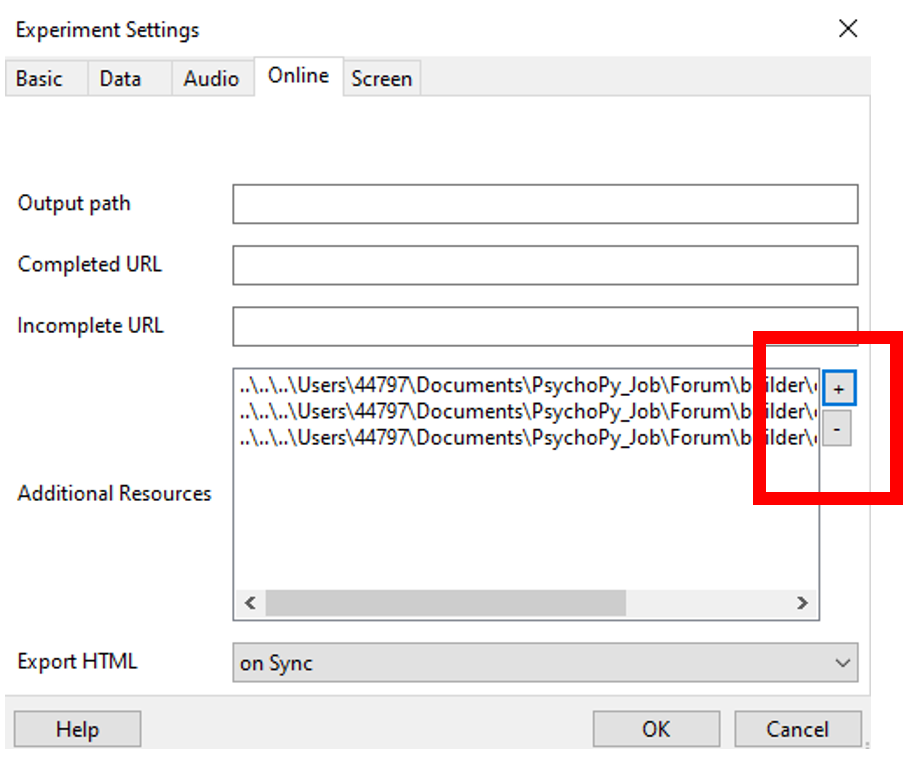
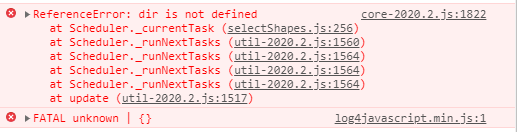
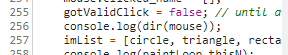

.. _onlineFromBuilder:

Creating online studies from Builder
-------------------------------------

PsychoPy can't export all possible experiments to PsychoJS scripts yet. "Standard" studies using images, text and keyboards will work. Studies with other stimuli, or that use code components, probably won't.

These are the steps you need to follow to get up and running online:

- :ref:`onlineCheckSupported`
- :ref:`onlineExpSettings`
- :ref:`onlineExportHTML`
- :ref:`onlineUploadServer`
- :ref:`onlineDebugging`
- :ref:`onlineParticipants`
- :ref:`fetchingData`

.. _onlineCheckSupported:

Check if your study is fully supported
~~~~~~~~~~~~~~~~~~~~~~~~~~~~~~~~~~~~~~~~~~~~~

Keep checking the :ref:`onlineStatus` to see what is supported. You might want to sign up to the `PsychoPy forum <http://discourse.psychopy.org>`_ and turn on "watching" for the `Online Studies <http://discourse.psychopy.org/c/online>`_ category to get updates. That way you'll know if we update/improve something and you'll see if other people are having issues.

.. _onlineExpSettings:

Check your experiment settings
~~~~~~~~~~~~~~~~~~~~~~~~~~~~~~~~~~~~~~~~~~~~~

In your Experiment Settings there is an "Online" tab to control the settings.

Path: When you upload your study to Pavlovia it will expect to find an 'html' folder in the root of the repository, so you want to set this up with that in mind. By default the output path will be for a folder called html next to the experiment file. So if that is in the root of the folder you sync online then you'll be good to go! Usually you would have a folder structure something like this and :ref:`sync that entire folder with pavlovia.org <pavloviaSync>`:

.. figure:: /images/foldersStimHTML.png
  :alt: Folder structure with the experiment (`blockedTrials.psyexp`), a `stims` folder in which the stimuli are stored, some conditions files and an `html` folder containing the code for the study to run online.

.. _onlineExportHTML:

Export the HTML files
~~~~~~~~~~~~~~~~~~~~~~~~~~~~~~~~~~~~~~~~~~~~~

Once you've checked your settings you can either go to `>File>Export HTML` from the Builder view with your experiment open OR press 'sync' from the globe icons.

Both of these will generate all the necessary files (HTML and JS) that you need for your study, however sync will also create a project in pavlovia.org

.. _onlineUploadServer:

Uploading files to your own server
~~~~~~~~~~~~~~~~~~~~~~~~~~~~~~~~~~~~~~~~~~~~~

We really don't recommend this and can only provide limited help if you go this route. If you do want to use your own server:

You will need some way to save the data. PsychoJS can output to either:

- `csv` files in `../data` (i.e. a folder called `data` next to the html folder). You'll need this to have permissions so that the web server can write to it
- a relational database
- You should make sure your server is using https to encrypt the data you collect from your participants, in keeping with GDPR legislation
- You will need to install the server-side script
- You will need to adapt PsychoPy Builder's output scripts (`index.html` and the `<experimentName>.js`) so that the references to `lib/` and `lib/vendors` are pointing to valid library locations (which you will either need to create, or point to original online sources)

.. _onlineDebugging:

Debug your online experiments
~~~~~~~~~~~~~~~~~~~~~~~~~~~~~~~~~~~~~~~~~~~~~

This is going to be trickier (for now) than the PsychoPy/Python scripts. The main resources we recommend are:

- `The PsychoPy to JS crib sheet <https://docs.google.com/document/d/13jp0QAqQeFlYSjeZS0fDInvgaDzBXjGQNe4VNKbbNHQ/edit>`_ a fantastic resource developed by `Wakefield Morys-Carter <https://twitter.com/Psych_Stats/>`_
- `The PsychoJS API <https://psychopy.github.io/psychojs/>`_
- `The forum <https://discourse.psychopy.org/>`_

Common problems
~~~~~~~~~~~~~~~

The majority of problems and solutions are outlined at `The PsychoPy to JS crib sheet <https://docs.google.com/document/d/13jp0QAqQeFlYSjeZS0fDInvgaDzBXjGQNe4VNKbbNHQ/edit>`_ but some common problems include.

**"My experiment works locally, but doesn't run online"***

This means there is a JS error. Likelt because of one of the following reasons:

- You have a code component where you have used something that can't be translated to JS (e.g. python libraries like 'numpy' and 'pandas').
    - *Solution* check if the function you are trying to use has been added to the crib sheet. If it has, implement it as below. If it has not, try searching 'JS equivilent of X function' in `stack overflow <https://stackoverflow.com/>`, try to implement it as below, if it works share your solution on discourse so that we can add it to the resources, if it does not, post your issue on discourse and tell us what you tried.
- You have a non-code component, but one of the parameters has been modified to a value that 'doesn't make sense' in JS.
    - *Solution* look at the `PsychoJS API <https://psychopy.github.io/psychojs/>`_ to see what types of variable each parameter of each component takes.

**"I have an 'Unknown Resources' Error"***

You can control what resources are loaded using the 'online' tab in your experiment settings.

Finding the problem
~~~~~~~~~~~~~~~

If you encounter an error when getting online and see a red error message box or you are *stuck on initializing* follow these steps:

1. open the developer tools (outlined on crib sheet).

2. look for the red line that corresponds to your task. In the example below, my task was called 'selectShapes' and we can see that there is an error on line 256 of the compiled JS code.

3. Examine what is happening on the line causing the error, either by clicking on the message in developer tools or by opening your .js file (usually automatically created on your local desktop when you synced) in a text editor with line numbering. In this example, I was trying to use a python method  `dir <https://docs.python.org/3/library/functions.html#dir>`_ which cannot be use in JS.

Fixing the problem
~~~~~~~~~~~~~~~

**We do not recommend making edits to your .js script. Make corrections to your builder .psyexp file**

In this example, I would look for the code component where I used the dir() method and remove it I could *a)* keep my code type as Auto->JS, remove it from the left hand (python side)  and it will automatically be removed from the JS side *b* change my code type to 'both' and remove it only from the right hand (JS) side (once this is done, code changes made in python will not be auto translated to JS).

Why do we not recommend making changes to your .js file?

- changes you make in your .js file will not be reflected back in your builder file, it is a one way street.
- it becomes more difficult to sync your experiment with pavlovia from psychopy (since the creation of experiment pages is mainly done through the builder interface)
- You might be comfortable using JS, but will future users? If you want future researchers to use your experiment having a visualisation of the experiment in GUI format may be more accessible to researcers less familiar with JS.

**Adding JS functions**

If you have a function you want to use, and you find the equivilent on the crib sheet or stack overflow, add an 'initialization' code component to the start of your experiment. Set code type to be 'JS' and copy and paste the function(s) you want there in the 'Begin experiment' tab. These functions will then be available to be called throughout the rest of the task.

.. image:: initializeJScode.png

.. _activateRecruitment:

Posting the issue on the forum
~~~~~~~~~~~~~~~

If you are struggling to debug your error you can always ask for help on `the forum <https://discourse.psychopy.org/>`_. So that the team and community can help, it is really helpful if we can see your files either by making your project public or by adding a member of the PsychoPy team as a member to your project.

**Making your task public**

To make your task public navigate to your experiment page then select > View code <> > settings > permissions (set to public)

.. image:: gitlabPublic.png
        :scale: 100 %

If you cannot make your task public share your problem and what you tried on the discourse and add a member of the team to your project (settings> members>add member - use the user name given by whoever is supporting you)

Activate on Pavlovia
~~~~~~~~~~~~~~~~~~~~~~~~~~~~~~~~~~~~~~~~~~~~~

Once your experiment is online you will see your experiment in dashboard> experiment, you can read more about the `Experiment page here <https://pavlovia.org/docs/experiments/experiment-page>`_.

.. _onlineParticipants:

Recruiting participants
~~~~~~~~~~~~~~~~~~~~~~~~~~~~~~~~~~~~~~~~~~~~~

Once you've uploaded your folder with the correct permissions you can simply provide that as a URL/link to your prospective participants. When they go to this link they'll see the info dialog box (with the same settings as the one you use in your standard PsychoPy study locally, but a little prettier). That dialog box may show a progress bar while the resources (e.g. image files) are downloading to the local computer. When they've finished downloading the 'OK' button will be available and the participant can carry on to your study.

Alternatively you may well want to recruit participants using an online service such as `prolific <https://www.prolific.co/>`_ you can read how to connect your experiment with prolific `here <https://www.psychopy.org/online/prolificIntegration.html>`_.

.. _fetchingData:

Fetching your data
~~~~~~~~~~~~~~~~~~~~~~~~~~~~~~~~~~~~~~~~~~~~~

The data are saved in a data folder next to the html file. You should see csv files there that are similar to your PsychoPy standard output files. (There won't be any psydat files though - that isn't possible from JavaScript).

You could just download the data folder or, if you've set it up to sync with an OSF project then you could simply sync your PsychoPy project with OSF (from the projects menu) and your data will be fetched to your local computer! :-)

