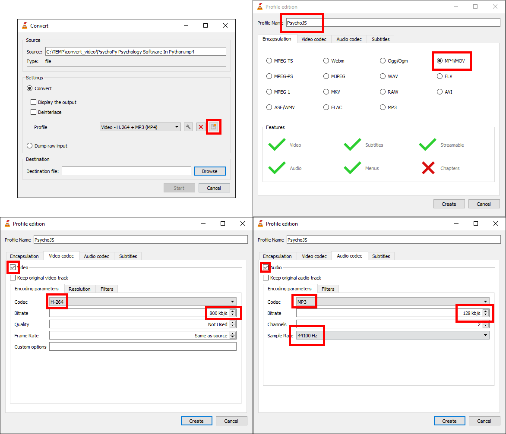

.. include:: ../global.rst

.. _onlineMediaFormats:

Media formats suitable for online studies
-----------------------------------------

When you want to present images, sounds, or movies online, two things are important to take into account:

1. Web-browsers may support different formats than PsychoPy does
2. Because all media need to be downloaded via internet, it can be handy to use formats that compress your media, so that they produce smaller files.

Below are some recommended formats and pointers how to convert your media with free and open source software.

Images: PNG or JPG
~~~~~~~~~~~~~~~~~~
Web-browsers support a large variety of image formats; see an `overview here <https://developer.mozilla.org/en-US/docs/Web/Media/Formats/Image_types>`_. Two widely supported formats are:

* PNG. This format applies "lossless" compression, which means that the compressed image is an exact reproduction of the original image. PNG is good at compressing pictures with geometric shapes, but natural scenes may yield relatively large files.
* JPG. This format applies "lossy" compression, which means that the compressed image approximates the original image. JPG can compress natural scenes very well. When encoding to JPG, you can adjust quality settings to produce larger (and more detailed) or smaller (and less detailed) files.
 
For converting images to PNG and JPG, you could use `GIMP <https://www.gimp.org/>`_. See `this tutorial <https://www.digitaltrends.com/computing/how-to-edit-multiple-photos-at-once/>`_ for instructions on how to convert multiple images at once using GIMP. By picking "Change Format and Compression" in step 4 of the tutorial you can select which format to save the images in.

Sounds: MP3
~~~~~~~~~~~
Here you can find an `overview <https://developer.mozilla.org/en-US/docs/Web/Guide/Audio_and_video_delivery/Cross-browser_audio_basics#Audio_Codec_Support>`_ of audio formats supported by web browsers. MP3 is the most widely supported format. MP3 performs lossy compression, so the sound may lose some detail, but you can adjust the quality level. At higher qualities, the loss in detail is negligible. 

For converting sound to MP3, you could use `VLC Player <https://www.videolan.org/vlc/>`_. See `this tutorial <https://www.vlchelp.com/convert-audio-format/>`_ for instructions on how to convert multiple sounds at once using VLC.

NB - Presently, PsychoPy does not yet support MP3.

Movies: MP4 + H.264 & MP3
~~~~~~~~~~~~~~~~~~~~~~~~~
Here you can find an `overview <https://developer.mozilla.org/en-US/docs/Web/Media/Formats/Video_codecs>`_ of video formats supported by web browsers. MP4 + H.264 + MP3 is the most widely supported format. 

* MP4 is a format that can contain video and audio
* H.264 is a format that encodes video
* MP3 is format that encodes audio

Both H.264 and MP3 perform lossy compression, so the video and audio may lose some detail, but you can adjust the quality level. At higher qualities, the loss in detail is negligible. 

For converting movies, you could use `VLC Player <https://www.videolan.org/vlc/>`_. See `this tutorial <https://www.vlchelp.com/convert-video-format/>`_ for instructions on how to convert multiple movies at once using VLC. To set up the output format correctly, we recommend making a new profile at step 4 in the tutorial above (see :numref:`videoSettings`):

1. Click the "New Profile" icon, then pick a name for your profile.
2. In the "Encapsulation" tab, select "MP4/MOV"
3. In the "Video codec" tab:

   a. Tick "Video" checkbox
   b. Select "H-264" as "Codec"
   c. Higher bitrates mean video that is of higher quality, but also larger files. Here are some `bitrate guidelines <https://www.videoproc.com/media-converter/bitrate-setting-for-h264.htm>`_ 

4. In the "Audio codec" tab:

   a. Tick the "Audio" checkbox
   b. Select "MP3" as "Codec"
   c. Higher bitrates mean audio that is of higher quality, but also larger files.
   d. For Sample Rate, 44100 Hz is a good choice
5. Finally, save your profile by clicking the "Create" button.

    Profile settings for encoding video to MP4 + H.264 & MP3

