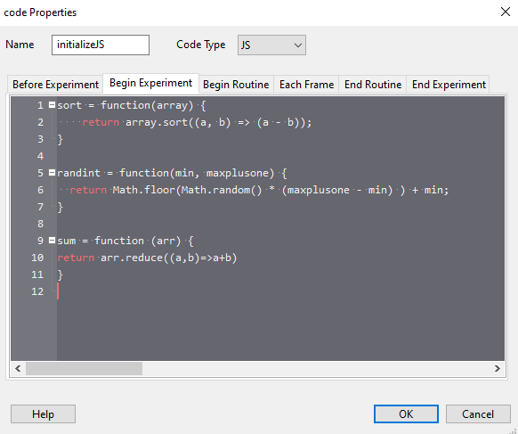

.. _psychoJSCodingDebugging:

PsychoJS Coding and Debugging
-----------------------------

While PsychoPy is based on Python, PsychoJS is based on JavaScript (JS). Below are some tips on how to coding and debugging JavaScript.

Debugging PsychoJS experiments
~~~~~~~~~~~~~~~~~~~~~~~~~~~~~~
Errors in you PsychoJS experiment can manifest in multiple ways. Below are tutorials for finding three different types of errors:

* **Experiment is stuck on "initialising the experiment...".** See the `tutorial_js_syntax_error experiment <https://gitlab.pavlovia.org/tpronk/tutorial_js_syntax_error>`_
* **PsychoJS shows a dialog with an error message.** See the `tutorial_js_semantic_error experiment <https://gitlab.pavlovia.org/tpronk/tutorial_js_semantic_error>`_
* **PsychoJS shows a dialog with "unknown resource" message.** See the `tutorial_js_network_error experiment <https://gitlab.pavlovia.org/tpronk/tutorial_js_network_error>`_

Once you've found the error, we recommend not to fix it by editing the generated JS experiment, but by making adjustments in the PsychoPy Builder.

Don't change the generated JS file
~~~~~~~~~~~~~~~~~~~~~~~~~~~~~~~~~~
When you export an experiment to HTML from the PsychoPy builder, it generates a JS file. We recommend *not* to edit this JS file, for the reasons below:

- Changes you make in your .js file will not be reflected back in your builder file; it is a one way street.
- It becomes more difficult to sync your experiment with |Pavlovia| from the |PsychoPy| builder
- Researchers that would like to replicate your experiment but aren't very JavaScript-savvy might be better off using the PsychoPy Builder

Working with JS Code Components
~~~~~~~~~~~~~~~~~~~~~~~~~~~~~~~
Code components can automatically convert Python to JavaScript. However, this doesn't always work. Below are some pointers to help you out:

- For common JS functions, see the `PsychoPy to JS crib sheet <https://docs.google.com/document/d/13jp0QAqQeFlYSjeZS0fDInvgaDzBXjGQNe4VNKbbNHQ/edit>`_ by `Wakefield Morys-Carter <https://twitter.com/Psych_Stats/>`_
- For finding out how to manipulate PsychoJS components via code, see the `PsychoJS API <https://psychopy.github.io/psychojs/>`_. The `tutorial_js_expose_psychojs experiment <https://gitlab.pavlovia.org/tpronk/tutorial_js_expose_psychojs>`_ shows how to expose PsychoJS objects to the web browser, so that you can access them via the browser console, and try things out in order to see what works (or not).
- If you're looking for a JS equivalent of a Python function, try searching 'JS equivalent/version of function X' on `stack overflow <https://stackoverflow.com/>`_ or `Google <https://google.com>`_
- Still stuck? Try asking for help on the `forum <https://discourse.psychopy.org/c/online/14>`_. For giving researchers access to the repository of your experiment, see :ref:`contributingToPavlovia`

Adding JS functions
~~~~~~~~~~~~~~~~~~~
If you have a function you want to use, and you find the equivalent on the crib sheet or stack overflow, add an 'initialization' code component to the start of your experiment. Set code type to be 'JS' and copy and paste the function(s) you want there in the 'Begin experiment' tab. These functions will then be available to be called throughout the rest of the task.

