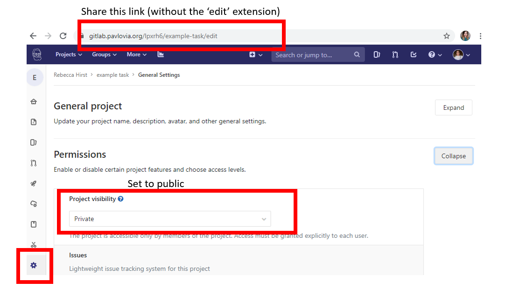

.. include:: ../global.rst

.. _sharingExperiments:

|Pavlovia| contains a collection of experiments that you can use as a starting point for your own experiment. Below we explain how you can search for experiments in this collection and contribute your own experiment.

Searching for experiments on Pavlovia
-------------------------------------
You can search for experiments via the |Pavlovia| website and from within the PsychoPy Builder.

Via the |Pavlovia| website
~~~~~~~~~~~~~~~~~~~~~~~~

From the |Pavlovia| home page, you can explore your own existing projects, or other users' public projects. To find a project, go to `Pavlovia's Explore page <https://pavlovia.org/explore>`_ (see :numref:`pavlovHome`).

.. figure:: /images/pavlovHome.png
    :name: pavlovHome
    :align: center
    :figclass: align-center

    The |Pavlovia| home page

When exploring studies online, you are presented with a series of thumbnail images for all of the projects on |Pavlovia|. See :numref:`explorePav`.

.. figure:: /images/explorePav.png
    :name: explorePav
    :align: center
    :figclass: align-center

    Exploring projects on |Pavlovia|

From the “Explore” page, you can filter projects by setting the filter buttons to a) Public or Private, b) Active or Inactive, and c) sort by number of forks, name, date and number of stars. The default sorting method is Stars. You can also search for projects using the search tool using keywords describing your area of interest, e.g., Stroop, or attention.

Via the PsychoPy Builder
~~~~~~~~~~~~~~~~~~~~~~~~
If you wish to search for your own existing projects on |Pavlovia|, or other users' public projects, you can also do this via the Builder interface. To search for a project, click button (3) on the Builder Frame in :numref:`builderViewIndexed2`.

.. figure:: /images/builderViewIndexed.png
    :name: builderViewIndexed2
    :align: center
    :figclass: align-center

    Buttons for running an online study from the PsychoPy Builder.

Following this, a search dialog will appear, see :numref:`searchDlgAnnot`. The search dialog presents several options that allow users to search, fork and synchronize projects.

.. figure:: /images/searchDlgAnnot.png
    :name: searchDlgAnnot
    :align: center
    :figclass: align-center

    The search dialog in Builder

**To search for a project** (see :numref:`searchDlgAnnot`, Box A), type in search terms in the text box and click the “Search” button to find related projects on |Pavlovia|. Use the search filters (e.g., “My group”, “Public” etc) above the text box to filter the search output. The output of your search will be listed in the search panel below the search button, where you can select your project of interest.

**To fork and sync a project** is to take your own copy of a project from |Pavlovia| (*fork*) and copy a version to your local desktop or laptop computer (*sync*). To fork a project, select the local folder to download the project using the “Browse” button, and then click “Sync” when you are ready - (see :numref:`searchDlgAnnot`, Box B). You should now have a local copy of the project from |Pavlovia| ready to run in PsychoPy!

.. _contributingToPavlovia:

Contributing an experiment to Pavlovia
--------------------------------------
If you contribute an experiment to Pavlovia, other researchers can access it. Besides contributing to open science, this can be handy if you've got an issue with your experiment and would like other researchers to take a look.

Making an experiment public
~~~~~~~~~~~~~~~~~~~~~~~~~~~
A public experiment is visible to anyone to clone and fork. To make your experiment public navigate to your experiments' GitLab page, then select > View code <> > Settings > Permissions (set to public). See :numref:`gitlabPublic`.

    Setting a GitLab project to public access

Adding a team member
~~~~~~~~~~~~~~~~~~~~
If you'd like to share your experiment only with specific researchers, navigate to your experiment, then select > View code <> > settings > Members. At this page: select a member, give them a role (to be able to fork your experiment, they should at least be Developer), optionally an access expiration date, and then add them. See :numref:`addingUserToGitlab`.

.. figure:: /images/addingUserToGitlab.png
    :name: addingUserToGitlab
    :align: center
    :figclass: align-center

    Adding a user to a GitLab project 
