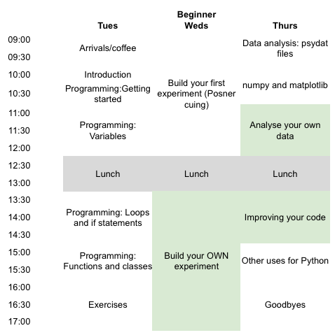

.. _P4N:

P4N 2016: Python for Neuroscience (and Psychology)
~~~~~~~~~~~~~~~~~~~~~~~~~~~~~~~~~~~~~~~~~~~~~~~~~~~~~~~

The workshop isn't finalised yet and you can't book places, but you can `register your interest <https://docs.google.com/forms/d/1gEKIc-eBsPYxCgVzMaqBh4CMQNMyyfO-s-p_y2WuxHE/viewform>`_ to be kept informed when we know the details.

.. image:: jumpAnimate.gif
   :width: 100 %
	
Do you want to get started using Python_ (and PsychoPy_) for your studies in behavioural sciences? Maybe you keep meaning to switch from another package and haven't gotten around to it. This workshop will get you off the ground with building and analysing your experiments using Python.

`Python`_ is a powerful well-designed programming language that's totally free and runs on all operating systems. It's a little like a free replacement for Matlab, but with more flexibility and better syntax!

`PsychoPy`_ is a modern, powerful, easy-to-use software package for conducting studies in psychophysics, neuroimaging and experimental psychology. It's become the package of choice in very many labs worldwide (see `PsychoPy usage stats <http://www.psychopy.org/usage.php>`_). It comes with a graphical interface (Builder) as well as a `Python` scripting interface (Coder), which will be the primary focus at this workshop.

The workshop is led by Jon Peirce, who created the core of PsychoPy and has over 10 years experience of Python programming and teaching students.

Details
------------

    :Spaces: 30 beginner (and 30 intermediate?)
    :When: TBA
    :Where: School of Psychology, University of Nottingham
    :Cost: £350
    :Includes: Refreshments and lunch. There is an accommodation package too, costing around £45 per night including bed and breakfast
    :Content:
        Material will cover *Python* programming basics as well as PsychoPy-specific coding. Note that this is not a workshop about PsychoPy Builder; we'll really be focussing on programming.
        
Is this suitable for you? 
----------------------------

The target audience is those that want to learn to program in Python for general use in science. We will focus on generating experiments: presenting stimuli and collecting responses, but also on basic analyses and plotting in Python as well.

We'll provide you with additional 'intermediate' material as well, for you to build on what you've learnt, but if you're already a proficient programmer in Python then this is probably not the course for you.
    
Schedule
------------------------

Some sessions will be self-paced (shown in green). We'll not start the first formal session until 10am on Day 1 (coffee available from 9am though) and we'll finish at 4pm on Day 3 to allow some travel flexibility. But you are welcome to hang around and continue working if you prefer.

[All sessions subject to change]

   

For any enquiries please email me at `jonathan.peirce at nottingham.ac.uk` (beware my strangely spelled surname when typing that in!)

.. _Python: http://www.python.org/
.. _PsychoPy: http://www.psychopy.org/
