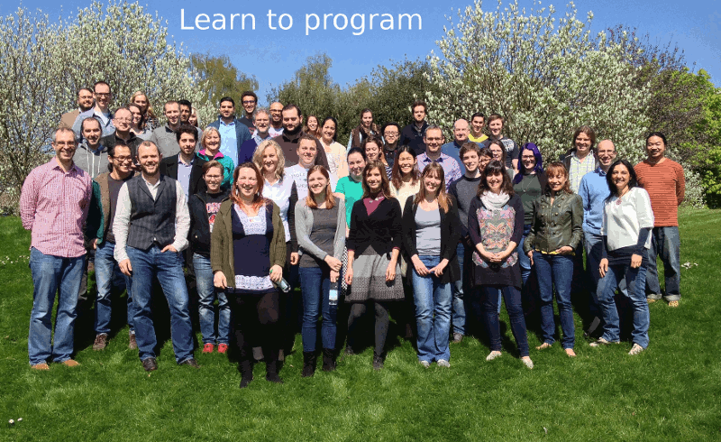
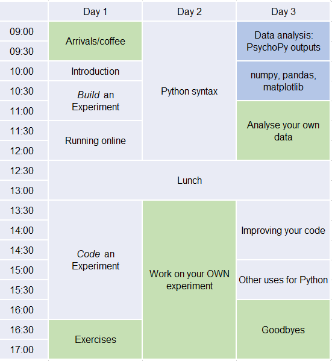

.. _officialWorkshops:

PsychoPy official workshops
===============================

You can `BOOK NOW ON Creating Experiments in PsychoPy <https://store.nottingham.ac.uk/conferences-and-events/conferences/schools-and-departments/psychology/cep-2020-creating-experiments-in-psychopy>`_

We typically run PsychoPy workshops at University of Nottingham in the Easter break.

In 2020, we plan to run **two** workshops:

- a dedicated PsychoPy workshop in Easter break, :ref:`CEP1`
- a new modular Summer School, called :ref:`pampr`

Do you want to get started using Python_ (and PsychoPy_) for your studies in behavioural sciences? 
Maybe you keep meaning to switch from another applications and haven't gotten around to it. These 
workshops, run by the creators of PsychoPy, will get you off the ground with building and analysing 
your experiments using Python.

Introduction
-------------------

`Python`_ is a powerful well-designed programming language that's totally free 
and runs on all operating systems. It's a little like a free replacement for 
Matlab, but with more flexibility and better syntax! Learning to program is a 
hugely important skill for scientists in the modern environment and the workshops 
we run (Beginner and Intermediate) will help you a great deal both in the basics 
of how to run a study but also in more general programming (like how to run a 
simulation, how to analyse data or how to alter a large number of image files in a script).

`PsychoPy`_ is a modern, powerful, easy-to-use software package for conducting 
studies in psychophysics, neuroimaging and experimental psychology. It's become 
the package of choice in very many labs worldwide (see 
`PsychoPy usage stats <http://www.psychopy.org/usage.php>`_). It comes with a 
graphical interface (Builder) as well as a `Python` scripting interface (Coder). 
The workshops we run cater to various audiences, according to whether you want 
to learn more about programming (most flexible) or about the graphical interface 
(fastest way to get a study up and running).

The workshops below are led by Jon Peirce, who created the core of PsychoPy and has been 
programming in Python and teaching behavioural scientists since 2003.

For queries about any of these please email `jonathan.peirce at nottingham.ac.uk` 
(beware my strangely spelled surname when typing that in!)

.. _CEP1:

CEP: Creating Experiments in PsychoPy
--------------------------------------------

Building and Coding in PsychoPy/Python

Bookings open now at `the Nottingham online store <https://store.nottingham.ac.uk/conferences-and-events/conferences/schools-and-departments/psychology/cep-2020-creating-experiments-in-psychopy>`_

Details
~~~~~~~~~~~~

:When: 28-30th Apr 2020 (inclusive)
:Where: School of Psychology, University of Nottingham
:Cost: £350
:Includes: Refreshments and lunch. There is an accommodation package too, costing £55 per night including bed, full breakfast and free wifi
:Content:
    Material will cover *Python* programming basics as well as PsychoPy-specific coding. Unlike previous years (which were pure Python coding we will teach Builder as well this year).

Is this suitable for you?
~~~~~~~~~~~~~~~~~~~~~~~~~~~~~~

We used to run the Easter workshop purely with Python programming but in 2020 we will, for the first time, 
incorporate both Builder and Coding interfaces, as well as talking about running studies online.

We will be aiming for a beginner audience but attendees that have some understanding of the basics 
beforehand will benefit: when we cover the basics it will feel like revision, and we get onto some 
intermediate materials it will be better "scaffolded" by your existing knowledge.

Schedule
~~~~~~~~~~~~~~~~~~~~~~~~~~~~~~

We will not start the first formal session until 10am on Day 1 (coffee available from 9am though) 
and we'll finish at 4pm on Day 3 to allow some travel flexibility. But you are welcome to hang 
around and continue working if you prefer.

All sessions subject to change. Sessions in **green** and **blue** are optional (for self-paced 
and specialist sessions, respectively).

.. _Python: http://www.python.org/
.. _PsychoPy: http://www.psychopy.org/

.. _pampr:

PaMPR (Programming and Methods in Psychology Research)
-----------------------------------------------------------

**7-11 Sept 2020. Rough cost: £450 plus accommodation.**

This is a new thing! It's a joint venture with Nottingham trent University.
I'm afraid we don't have the draft programme in place yet but the
general idea is to create a 5 day modular summer school. There will be a number of sessions 
running continuously on the main programming languages:

- Python and PsychoPy
- R 
- Matlab

as well as various specialist methods sections such as:

- EEG
- eye-tracking
- web experiments
- ...

The whole thing will be more modular, so you can drop into whichever sessions you want
the most. We hope it will offer a richer learning environment than we can provide with the
PsychoPy team on its own.

We'll probably finish with a day of mini-conference for people to share methods new(ish) they're
developing that others might find interesting.
