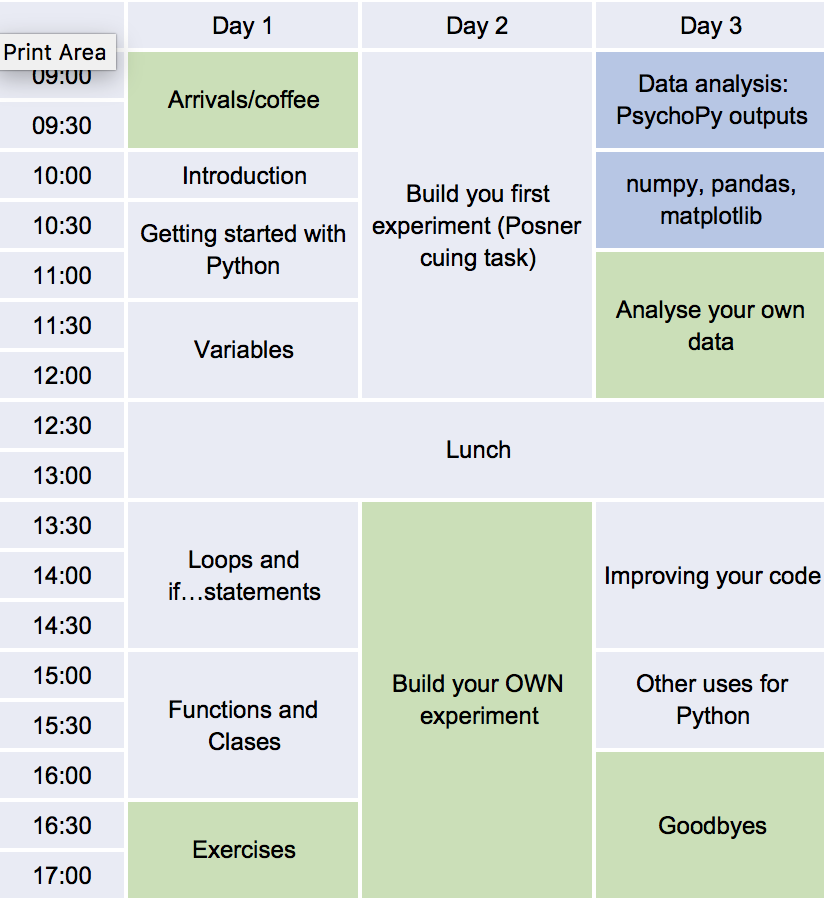
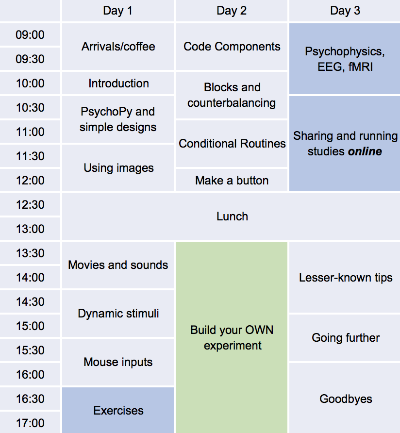

.. _officialWorkshops:

PsychoPy official workshops
===============================

The following workshop is currently planned for 2018:

 - 16-18 Apr 2018: :ref:`PEP1`
 - 3-5 May 2017: :ref:`BEP`
 - 12-14 July 2017: :ref:`PEP2`

(Details below, booking site will be online soon)

Do you want to get started using Python_ (and PsychoPy_) for your studies in behavioural sciences? Maybe you keep meaning to switch from another applications and haven't gotten around to it. These workshops, run by the creators of PsychoPy, will get you off the ground with building and analysing your experiments using Python.

.. image:: jumpAnimate.gif
   :width: 100 %

`Python`_ is a powerful well-designed programming language that's totally free and runs on all operating systems. It's a little like a free replacement for Matlab, but with more flexibility and better syntax! Learning to program is a hugely important skill for scientists in the modern environment and the workshops we run (Beginner and Intermediate) will help you a great deal both in the basics of how to run a study but also in more general programming (like how to run a simulation, how to analyse data or how to alter a large number of image files in a script).

`PsychoPy`_ is a modern, powerful, easy-to-use software package for conducting studies in psychophysics, neuroimaging and experimental psychology. It's become the package of choice in very many labs worldwide (see `PsychoPy usage stats <http://www.psychopy.org/usage.php>`_). It comes with a graphical interface (Builder) as well as a `Python` scripting interface (Coder). The workshops we run cater to various audiences, according to whether you want to learn more about programming (most flexible) or about the graphical interface (fastest way to get a study up and running).

The workshops are led by Jon Peirce, who created the core of PsychoPy and has been programming in Python and teaching behavioural scientists since 2003.

For queries about any of these please email me at `jonathan.peirce at nottingham.ac.uk` (beware my strangely spelled surname when typing that in!)

.. _PEP1:

PEP1: Programming Experiments in Python (Beginners)
---------------------------------------------------------

`Book onto Programming Experiments in Python workshop now <http://store.nottingham.ac.uk/conferences-and-events/conferences/schools-and-departments/psychology/pep-programming-experiments-in-python-beginners>`_

Details
~~~~~~~~~~~~

    :When: 26-28 April 2017 (inclusive)
    :Where: School of Psychology, University of Nottingham
    :Cost: £350
    :Includes: Refreshments and lunch. There is an accommodation package too, costing £46 per night including bed, full breakfast and free wifi
    :Content:
        Material will cover *Python* programming basics as well as PsychoPy-specific coding. Note that this is not a workshop about PsychoPy Builder; we'll really be focussing on programming.

Is this suitable for you?
~~~~~~~~~~~~~~~~~~~~~~~~~~~~~~

The target audience is those that want to learn to program in Python for general use in science. We will focus on generating experiments: presenting stimuli and collecting responses, but also on basic analyses and plotting in Python as well. **If you want to get up and running more quickly or want to run studies online then you'd be better going to the PsychoPy Builder workshop instead (see below).**

We'll provide you with additional 'intermediate' material as well, for you to build on what you've learnt, but if you're already a proficient programmer in Python then this is probably not the course for you.

Schedule
~~~~~~~~~~~~~~~~~~~~~~~~~~~~~~

We'll not start the first formal session until 10am on Day 1 (coffee available from 9am though) and we'll finish at 4pm on Day 3 to allow some travel flexibility. But you are welcome to hang around and continue working if you prefer.

All sessions subject to change. Sessions in **green** and **blue** are optional (for self-paced and specialist sessions, respectively).

.. _BEP:

BEP: Building Experiments in PsychoPy
---------------------------------------------------------

`Book onto Building Experiments in PsychoPy workshop now <http://store.nottingham.ac.uk/conferences-and-events/conferences/schools-and-departments/psychology/bep-building-experiments-in-psychopy>`_

Learning to *Build* experiments is the fastest way to get studies up and running. You can do an awful lot with a graphical interface and some bits of Python code plugged in to do the fancy stuff! That's what we'll be learning here.

Details
~~~~~~~~~~~~

    :When: 3-5 May 2017 (inclusive)
    :Where: School of Psychology, University of Nottingham
    :Cost: £350
    :Includes: Refreshments and lunch. There is an accommodation package too, costing £46 per night including bed, full breakfast and free wifi
    :Content:
        Material will focus on *PsychoPy* Builder environment predominantly, with some sprinklings of Python to do more custom things.

Is this suitable for you?
~~~~~~~~~~~~~~~~~~~~~~~~~~~~~~

This workshop is suitable for beginners and those that don't want to learn substantial amounts of programming but want to get their study up and running fast.

Schedule
~~~~~~~~~~~~~~~~~~~~~~~~~~~~~~

We'll not start the first formal session until 10am on Day 1 (coffee available from 9am though) and we'll finish at 4pm on Day 3 to allow some travel flexibility. But you are welcome to hang around and continue working if you prefer.

All sessions subject to change. Sessions in **green** and **blue** are optional (for self-paced and specialist sessions, respectively).

.. _PEP2:

PEP2: Programming Experiments in Python (Intermediate)
---------------------------------------------------------

`Book onto the intermediate Programming Experiments in Python workshop now <http://store.nottingham.ac.uk/conferences-and-events/conferences/schools-and-departments/psychology/pep2-programming-experiments-in-python-intermediates>`_

Details
~~~~~~~~~~~~

    :When: 12-14th July 2017 (inclusive)
    :Where: School of Psychology, University of Nottingham
    :Cost: £350
    :Includes: Refreshments and lunch. There is an accommodation package too, costing £46 per night including bed, full breakfast and free wifi

Is this suitable for you?
~~~~~~~~~~~~~~~~~~~~~~~~~~~~~~

This workshop is for people that have some experience in Python already. We expect you to know the basic syntax of data types (dicts, lists etc.) and flow control (loops, conditionals). It's about making your Python programming *better*. For instance, we'll be picking up the basic version of an experiment (as taught in the Beginners workshop) and making it more precise.

Schedule
~~~~~~~~~~~~~

Many of the sessions will mirror the concepts taught in the Beginners version (PEP1 above) but the concepts are taught faster so we'll get into more depth. Basically, because we don't need to explain the syntax of the code so much we can focus more on the cool stuff!

We'll not start the first formal session until 10am on Day 1 (coffee available from 9am though) and we'll finish at 4pm on Day 3 to allow some travel flexibility. But you are welcome to hang around and continue working if you prefer.

All sessions subject to change. Sessions in **green** and **blue** are optional (for self-paced and specialist sessions, respectively).

.. image:: schedulePEP2.png
   :scale: 70 %
   :align: center

.. _Python: http://www.python.org/
.. _PsychoPy: http://www.psychopy.org/
