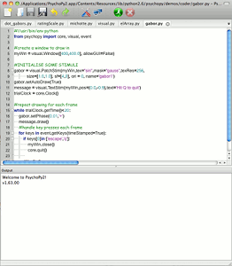
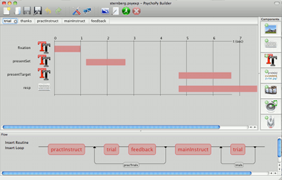
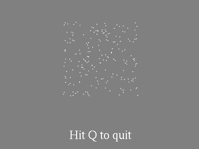
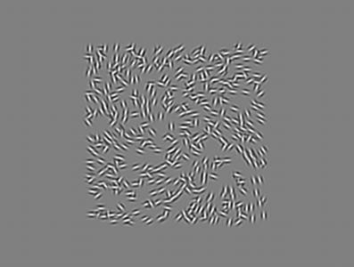
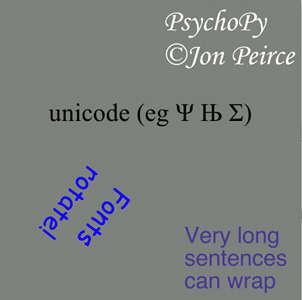
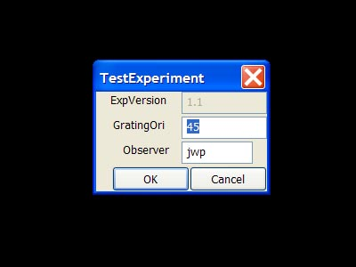

Screenshots
=====================================

A few screenshots are provided here to give you a flavour, but it's easier to download the software and run the demos (from the demos menus in each view) to see the variety of stimuli that can be generated. 

The :ref:`coder` view, for those that like to program (or just use your own editor), and the :ref:`builder` view for those that don't:

   

   
PsychoPy can handle every type of stimulus you can imagine...

Images and movies of most formats:

.. image:: images/demo_face.jpg
   :alt: images

Random dots and element arrays, drawn in realtime:

   

   
Many text options and dialog boxes:
   

   

   
   