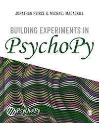

Resources for teaching and learning
=====================================

There are a number of further resources to help learn/teach about PsychoPy.

If you also have PsychoPy materials/course then please let us know so that we can link to them from here too!

.. _alevel:

Teaching PsychoPy at A-level?
-----------------------------

The resources below are useful for anyone interested in learning PsychoPy, but if you're teaching (or learning!) at A-level or lower we now have a dedicated page for `schools resources! <https://schools.psychopy.org>`_

.. _youtube:

Youtube tutorials
-----------------

- There is our `YouTube PsychoPy playlist <https://www.youtube.com/playlist?list=PLFB5A1BE51964D587>`_
  showing how to build basic experiments in the :ref:`builder` interface.
- `Jason Ozubko <https://www.geneseo.edu/psychology/ozubko>`_ has added a series of great `PsychoPy Builder video tutorials <https://www.youtube.com/playlist?list=PL6PJquR5BWXllUt585cRJWcRTly55iXTm>`_ too
- `Damien Mannion <https://www.djmannion.net/>`_ added a similarly great series of `PsychoPy programming videos on YouTube`_
- ... and a `searching YouTube for PsychoPy <https://www.youtube.com/results?search_query=psychopy>`_
  reveals many more!
- `Holly Sullivan-Toole <https://scholar.google.com/citations?hl=en&user=Iyg7PBgAAAAJ&view_op=list_works&gmla=AJsN-F6ghd3iXygqylKZ_dDl8-4jLddKkWl2hxSR2X3nXJ--itN8ZwoBPC2dTT9lZ7WqEhYe7MebbQRAK731QcyTlwH0TJgLOw>`_ has an excellent set of tutorials for `getting started with PsychoPy and Pavlovia <https://www.youtube.com/watch?v=0a05xCc6X8s>`_

.. _lectureMaterials:

Materials for Builder
---------------------

The **most comprehensive guide** is the book `Building Experiments in PsychoPy <https://us.sagepub.com/en-us/nam/building-experiments-in-psychopy/book273700>`_ by Peirce, Hirst and MacAskill.
  The book is suitable for a wide range of needs and skill sets, with 3 sections for:

- The Beginner (suitable for undergraduate teaching)
- The Professional (more detail for creating more precise studies)
- The Specialist (with info about specialist needs such as studies in fMRI, EEG, ...)

- `Susan Benear <https://sites.temple.edu/cnltu/susan-benear/>`_ has created some fantastic `content on using PsychoPy builder <https://tu-coding-outreach-group.github.io/cog_summer_workshops_2021/psychopy/index.html>`_  delivered as part of the Coding Outreach Group Summer Workshop. All materials are also share on `github <https://github.com/TU-Coding-Outreach-Group/cog_summer_workshops_2021/tree/main/psychopy>`_

.. _undergraduateMaterials:

Undergraduate course material
-----------------------------

At `School of Psychology, University of Nottingham`_, PsychoPy is now used for all first year practical class teaching. The classes that comprise that first year course are provided below. They were created partially with funding from the former `Higher Education Academy Psychology Network`_.

- `PsychoPy Undergraduate Practicals <https://psychology.nottingham.ac.uk/staff/lpzjd/psgy1001-21/psychopy-basics.html>`_ (last updated: 12 Jan 2022). Thanks `Jan Derfuss <https://www.nottingham.ac.uk/psychology/people/jan.derrfuss>`_

We have started putting together an  `experiment recipe book <https://workshops.psychopy.org/tutorials/index.html>`_ with a range of basic experiments and exercises pitched at a range of levels (open to submissions and contributions!). 

There's a set of tools for `teaching psychophysics using PsychoPy <https://github.com/jamesferwerda/PsychoPysics>`_
and a `PsychoPysics poster from VSS <https://github.com/jamesferwerda/PsychoPysics/blob/master/ferwerda18_vss_poster.key.pdf>`_.
Thanks `James Ferwerda <https://jamesferwerda.wordpress.com>`_

Materials for Online
--------------------
 
The online side of PsychoPy and the online platform for hosting studies (pavlovia.org) is much newer than PsychoPy itself, so there are less materials (but we are working on it!). The community has so far been excellent in sharing learning materials and demos - if you know of anything we have missed, please get in touch with us!

- `Wakefield Morys Carter <https://uk.linkedin.com/in/wakecarter>`_ has a fantastic (extensive!) list of `useful resources and demos for help with getting online <https://moryscarter.com/vespr/psychopy.php>`_
- `Nabil Hasshim's <https://scholar.google.co.uk/citations?user=6lcBBpcAAAAJ&hl=en>`_ has shared detailed documentation on `linking pavlovia experiments with SONA and Qualtrics <https://osf.io/wm5gd>`_
- `Jason Geller <https://www.drjasongeller.com/>`_ has also provided `a youtube tutorial on daisy chainging pavlovia, sona and qualtrics <https://youtu.be/SAbKAz4M-Rg>`_ 

Materials for Coder
-------------------

- The University of Amsterdam run a `two week Python and PsychoPy course <https://lukas-snoek.com/introPy/>`_ as part of their Research Masters in Psychology course `Lukas Snoek <https://lukas-snoek.com/>`_ makes all of the materials openly available.
- `Rebecca Mayer <https://www.uni-koblenz-landau.de/de/landau/fb8/biopsy-klinpsy/biopsy/Team/rebecca_mayer>`_ and Dominik Kraft from the `Open Science Initiative <https://frankfurt-osi.netlify.app/top/members/>`_ teach an `introductory course to python and PsychoPy for Psychologists <https://github.com/remayer/WS19_Python_for_Psychologists>`_ at the University of Frankfurt.
- `Gary Lupyan <http://sapir.psych.wisc.edu/>`_ runs a class on programming
  experiments using Python/PsychoPy and makes his lecture materials available
  `on this wiki <http://sapir.psych.wisc.edu/programming_for_psychologists/>`_
- Jonas Kristoffer Lindeløv openly shares materials for `Stimulus delivery for neuroscience and psychophysics: a PsychoPy course <https://lindeloev.net/psychopy-course/>`_
- `Programming for Psychology in Python  <https://www.djmannion.net/psych_programming/vision/intro/intro.html>`_
  has lessons and screencasts on PsychoPy (by `Damien Mannion <http://www.djmannion.net/>`_, UNSW Australia).
- Marco Bertamini's book, `Programming Illusions for Everyone`_ is a fun way to
  learn about stimulus rendering in PsychoPy by learning how to create visual illusions.
- The `GestaltReVision group (University of Leuven) <http://gestaltrevision.be>`_
  offers a `three-day crash course to Python and PsychoPy on a IPython Notebook
  <http://nbviewer.ipython.org/github/gestaltrevision/python_for_visres/blob/master/index.ipynb>`_,
  and has lots of great information taking you from basic programming to advanced techniques.
- Radboud University, Nijmegen also has a
  `PsychoPy programming course <https://www.socsci.ru.nl/wilberth/psychopy/00intro.html>`_
- Want to try PsychoPy in a different python environment? `Reshanne Reeder <https://www.reshannereeder.com/>`_ has shared a set of `Python tutorials in the Spyder environment <https://kerblooee.github.io/pytutorial/>`_.

---------------------------------

.. _School of Psychology, University of Nottingham: http://www.nottingham.ac.uk/psychology
.. _Higher Education Academy Psychology Network: https://www.advance-he.ac.uk/knowledge-hub/tags/higher-education-academy-psychology-network-0
.. _Building Experiments in PsychoPy: https://uk.sagepub.com/en-gb/eur/building-experiments-in-psychopy/book253480
.. _Programming Illusions for Everyone: https://www.springer.com/gb/book/9783319640655
.. _PsychoPy programming videos on YouTube: https://www.youtube.com/playlist?list=PLuqBA9VDSXk7Z06RtJ6Gh6Y5YznVrFrK6
.. _PsychoPy Builder video tutorials: https://www.youtube.com/playlist?list=PL-KTa_GY7VEMehFKqnBgIg48KqbKwSj-a
